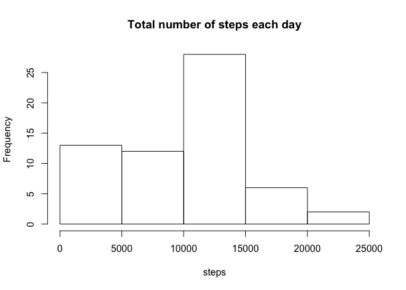
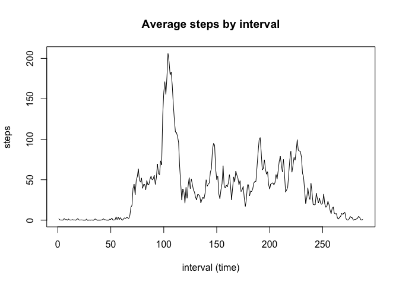
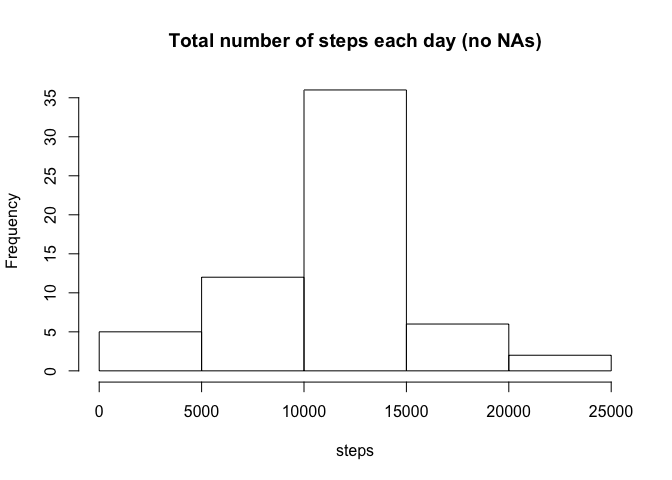
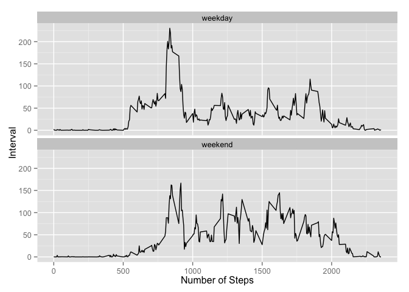

# Reproducible Research: Peer Assessment 1


### Loading and preprocessing the data
Load the data (i.e. 𝚛𝚎𝚊𝚍.𝚌𝚜𝚟())

```r
# Read CSV file
data = read.csv('activity.csv', header = TRUE, sep=",")

# Show first rows
head(data)
```

```
##   steps       date interval
## 1    NA 2012-10-01        0
## 2    NA 2012-10-01        5
## 3    NA 2012-10-01       10
## 4    NA 2012-10-01       15
## 5    NA 2012-10-01       20
## 6    NA 2012-10-01       25
```

### What is mean total number of steps taken per day?
For this part of the assignment, you can ignore the missing values in the dataset.

Calculate the total number of steps taken per day

```r
# Sum of steps, by date and remove the missing values
stepsperday <- tapply(data$steps, data$date, sum, na.rm = TRUE)
```

Make a histogram of the total number of steps taken each day

```r
# Histogram
hist(stepsperday, main = "Total number of steps each day", xlab = "steps")
```



Calculate and report the mean and median of the total number of steps taken per day

```r
# Mean
mean1 = mean(stepsperday)
print(mean1)
```

```
## [1] 9354.23
```

```r
# Median
median1 = median(stepsperday)
print(median1)
```

```
## [1] 10395
```


### What is the average daily activity pattern?
Make a time series plot (i.e. 𝚝𝚢𝚙𝚎 = "𝚕") of the 5-minute interval (x-axis) and the average number of steps taken, averaged across all days (y-axis)

```r
# Sum of steps, by interval and remove the missing values
steps_by_interval <- tapply(data$steps, data$interval, FUN=mean, na.rm = TRUE)

# Plot
plot(steps_by_interval, type = 'l', main = "Average steps by interval", xlab = "interval (time)", ylab = "steps")
```




Which 5-minute interval, on average across all the days in the dataset, contains the maximum number of steps?

```r
# Find index of this interval
index = names(which.max(steps_by_interval))
interval_with_maximum_value = steps_by_interval[index]

# Show the interval with it maximum value
print(interval_with_maximum_value)
```

```
##      835 
## 206.1698
```


### Imputing missing values
Calculate and report the total number of missing values in the dataset (i.e. the total number of rows with 𝙽𝙰s)

```r
# Sum of all rows that are not complete
nr_of_nas <- sum(!complete.cases(data))

#
print(nr_of_nas)
```

```
## [1] 2304
```


Create a new dataset that is equal to the original dataset but with the missing data filled in.
For this, we will add the mean of the specific interval (over all days) where we have a NA in the column steps.

```r
# Calculate means of intervals over all days
means <- tapply(data$steps, data$interval, mean, na.rm = TRUE)

# Create data frame for easy reference
means_df = as.data.frame.table(means)
names(means_df) = c("interval","mean")

# Use these means of intervals over all days to fill in the NA's
data_new = data
for (i in 1:nrow(data_new)) {
    # If NA is found
    if (is.na(data_new$steps[i])) {
        # What is interval for this NA
        interv = data_new$interval[i]
        # Add mean for this interval
        data_new$steps[i] = means_df[means_df$interval == interv,]$mean
    }
}

# data_new contains the original dataset, but with the NA's filled in
head(data_new)
```

```
##       steps       date interval
## 1 1.7169811 2012-10-01        0
## 2 0.3396226 2012-10-01        5
## 3 0.1320755 2012-10-01       10
## 4 0.1509434 2012-10-01       15
## 5 0.0754717 2012-10-01       20
## 6 2.0943396 2012-10-01       25
```


Make a histogram of the total number of steps taken each day and Calculate and report the mean and median total number of steps taken per day. 

```r
# Sum of steps, by date
stepsperday2 <- tapply(data_new$steps, data_new$date, sum)

# Histogram
hist(stepsperday2, main = "Total number of steps each day (no NAs)", xlab = "steps")
```



```r
# Mean
mean2 = mean(stepsperday2)
print(mean2)
```

```
## [1] 10766.19
```

```r
# Median
median2 = median(stepsperday2)
print(median2)
```

```
## [1] 10766.19
```
As 2304 values were added to replace the NA's in the original dataset, the mean and median have changed in relation to the mean and median of the first part of the assignment.


### Are there differences in activity patterns between weekdays and weekends?
Create a new factor variable in the dataset with two levels – “weekday” and “weekend” indicating whether a given date is a weekday or weekend day.

```r
# Start with copy of current dataset
data_new2 = data_new

# Add a new variable "weekday" with weekday-name of given date
data_new2$weekday = weekdays(as.Date(data_new$date))

# Add a new variable "weekdaytype" with the value weekday as default
data_new2$weekdaytype = "weekday"

# Overwrite this weekdaytype variable if it concerns a weekend
weekends = which(data_new2$weekday %in% c("Saturday","Sunday"))
data_new2[weekends,]$weekdaytype = "weekend"

# See
head(data_new2)
```

```
##       steps       date interval weekday weekdaytype
## 1 1.7169811 2012-10-01        0  Monday     weekday
## 2 0.3396226 2012-10-01        5  Monday     weekday
## 3 0.1320755 2012-10-01       10  Monday     weekday
## 4 0.1509434 2012-10-01       15  Monday     weekday
## 5 0.0754717 2012-10-01       20  Monday     weekday
## 6 2.0943396 2012-10-01       25  Monday     weekday
```

Make a panel plot containing a time series plot (i.e. 𝚝𝚢𝚙𝚎 = "𝚕") of the 5-minute interval (x-axis) and the average number of steps taken, averaged across all weekday days or weekend days (y-axis). 

```r
# Calculate / aggregate means per weekdaytype
means2 = aggregate(steps ~ interval + weekdaytype, data_new2, mean)

# Plot
library(ggplot2)
graph = qplot(interval, steps, data = means2, geom=c("line"), ylab = "Interval", xlab = "Number of Steps")

# Add facet and set one column
graph = graph + facet_wrap(~ weekdaytype, ncol=1)

# Show graph
print(graph)
```



